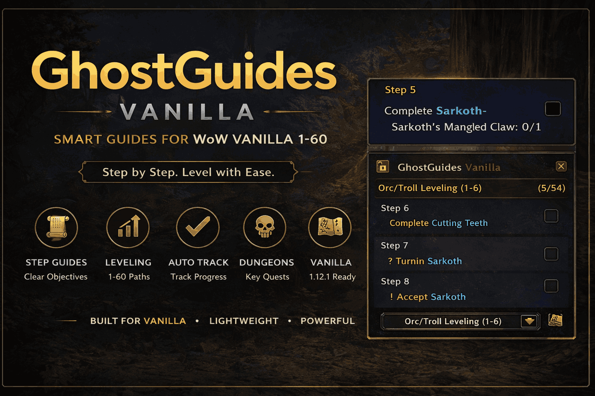

# GhostGuides Vanilla

<p align="center">
  
</p>

> ⚠️ **Beta Build**
>
> GhostGuides Vanilla is currently in **beta** and still under active development.  
> The addon is already fully usable, but some UI elements, tracking systems and guide logic are still receiving additional polishing and fine tuning.

GhostGuides Vanilla is a complete overhaul based on the original **GuidelimeVanilla** project by JeromeM.

Designed for **World of Warcraft Classic Vanilla 1.12.1**, this addon includes:

- Full **1–60 Horde leveling guides** by GhostGuides
- **Sage 1–60 Alliance leveling guides**
- Smart **step tracking**
- Separate **active step tracker**
- Dedicated **ongoing objective windows**
- Automatic **quest progress tracking**
- Automatic **navigation arrow / waypoint system**
- Talent recommendations
- Improved modernized UI
- Persistent saved guide progress

---

## Credits

This project is based on:

- **GuidelimeVanilla** by JeromeM  
  https://github.com/JeromeM/GuidelimeVanilla

Integrated guide packs:

- **GhostGuides 1–60 Horde leveling guides**
- **Sage 1–60 Alliance leveling guides**

Special thanks to the original authors and the Vanilla addon community.

---

## Required Folder Structure

The folder structure **must remain exactly like this**.

`GhostGuidesVanilla` must be placed on the **same directory level** as both guide folders.

```text
Interface/
└── AddOns/
    ├── GhostGuidesVanilla
    ├── GhostGuides
    └── GuidelimeVanilla_Sage
```

This structure is required so the addon can correctly detect and load all available guide packs.

If folders are renamed, nested or moved, guide loading may fail.

---

## Installation

Copy all folders into:

```text
World of Warcraft/
└── Interface/
    └── AddOns/
```

Required folders:

```text
GhostGuidesVanilla
GhostGuides
GuidelimeVanilla_Sage
```

After installation restart the game or reload the UI.

---

## Features

### Active Step Tracker
Displays the current active step in a separate floating tracker window.

### Ongoing Objectives
Objectives marked with `[O]` remain visible in their own dedicated windows until completed.

### Automatic Quest Progress
Quest progress updates automatically in real time.

Example:

```text
Collect Harpy Wings (3/8)
```

### Navigation Arrow
Automatic waypoint arrow that guides you to the next objective.

### Persistent Progress
The following are saved automatically:

- selected guide
- checked steps
- current progress
- tracker window positions
- settings

---

## Supported Version

- WoW Vanilla 1.12.1
- Turtle WoW compatible
- Vanilla private server compatible

---

## Current Status

This addon is currently in **active beta development**.

Upcoming improvements may include:

- UI polishing
- additional guide improvements
- better quest progress detection
- additional tracker improvements
- performance optimizations
